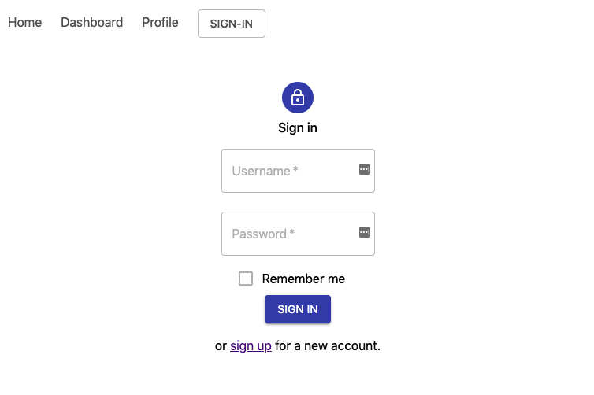

# React-Material-TypeScript Starter Project

Starter project with React, Material UI, and Typescript.



## Approach

This project is a template for bootstrapping a React project with the following goals:

* Use the tools and frameworks listed below.
* Use React functional components.
* Adopt a more functional programming design and approach in the code.
* Keep the code and project structure well-understood, simple, and clean.

### Frameworks

* [React](https://reactjs.org/) - Web client library.
* [TypeScript](http://www.typescriptlang.org) - Framework that makes JavaScript code strongly typed.
* [React Router](https://reacttraining.com/react-router/core) - Routing library for React. We use [the newer version 6](https://reacttraining.com/blog/react-router-v6-pre/), which is in Beta now but should be in full release soon.
* [Material UI](https://material-ui.com/) - UI components for Material Design.
* [React Testing Library](https://testing-library.com/docs/react-testing-library/intro/) - Test framework.

### Tools

* [Jest](https://facebook.github.io/jest/) - The default test runner that comes with create-react-app.
* [Prettier](https://prettier.io/) - Formatting tool.
* [TSLint](https://palantir.github.io/tslint/) - Lint tool for TypeScript.
* [Yarn](https://yarnpkg.com/) - Yarn as the package manager.

## Setup

In the project directory, you can run:

### Start the App in Development Mode

1. Run the app in development mode with hot loading.

   ```bash
   $ yarn start
   ```

1. Launch a web browser and navigate to [http://localhost:3000](http://localhost:3000).

### Test the App

1. Run tests against the app with watch mode.

   ```bash
   $ yarn test
   ```

See the section about [running tests](https://facebook.github.io/create-react-app/docs/running-tests) for more information.

### Build a Production Build

1. Build the app for production deployment with minification and optimization.

   ```bash
   $ yarn build
   ```

See the section about [deployment](https://facebook.github.io/create-react-app/docs/deployment) for more information.

## Credits

* [React Cookbook](https://learning.oreilly.com/library/view/react-cookbook/9781492085836/) by David Griffiths and Dawn Griffiths, O'Reilly Media, Inc.
* [Samuel L. Ipsum](https://slipsum.com/) - Normal lorem ipsum is just (well) boring. Text placeholders in this project are generated from Samuel L. Jackson's movie quotes (the sanitized ones).
* [My JSON Server](my-json-server.typicode.com) - Use fake online REST server for connecting with this client application.

# Reference

* [Material UI Color Palette](https://material-ui.com/customization/color/)
